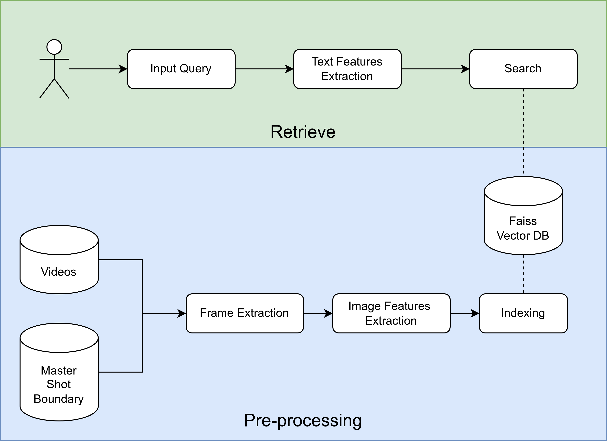

## Setup Enviroment

```bash
# clone the repo
git clone https://github.com/aiclub-uit/TRECVID-AVS
cd TRECVID-AVS

# setup docker images
docker build . -t trecvid

# run docker container
docker run -it -v <mount_data_to_container> \
        --gpus <gpu_ids> trecvid bash
```

## Usage

Now you are in Docker containers.

#### Step 1: Extract frames

```bash
cd /TRECVID/ExtractFrames
python extract.py \
    --video-dir <path_video_folder> \
    --msb-dir <path_master_shot_folder> \
    --skip-frame <frequency_frame_extraction> \
    --start <id_start_video> \
    --end <id_end_video> \
    --path-save <path_to_save_extracted_frames> \
```

The folder structure of extracted frames:

```bash
extracted_shot/
|-- done.txt # list extracted videos
`-- keyframes
    |-- 07476
    |-- 07477
    |-- 07499
```

#### Step 2: Encode features

We used CLIP ViT-L/14@336p to extract image features from extracted frames from videos.

```bash
cd /TRECVID/ExtractFeatures
python clip_model.py \
    --path-frame <path_saved_extracted_frames> \
    --path-save <path_to_save_features>
```

#### Step 3: Index to Faiss

Extracted image features are then indexed to Faiss vector database for later retrieval.

```bash
cd /TRECVID/IndexDatabases
python index_faiss.py \
    --path-features <path_saved_features> \
    --path-frame <path_saved_extracted_frames> \
    --path-save <path_to_save_faiss_data>
```

#### Step 4: Retrieve

The text features of input query are extracted and searched in the Faiss vector database.

```bash
cd /TRECVID/Retrieve
python retrieve.py \
    --path-faiss <path_saved_faiss_data> \
    --path-frame <path_saved_extracted_frames> \
    --query <query_to_retrieve> \
    --num-retrieve <number_results> \
    --save-path <path_to_save_ranking_results>
```